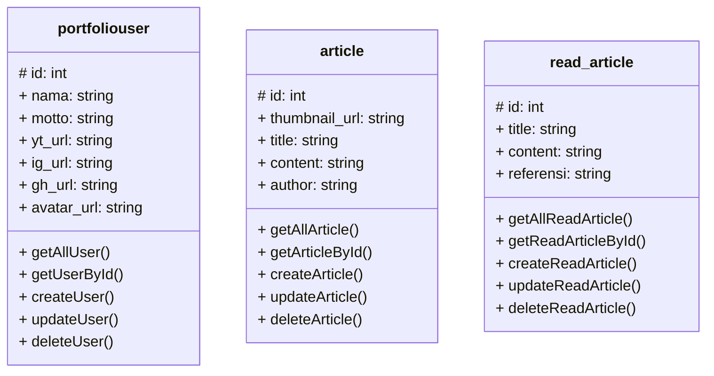

## API Points

Berikut adalah entitas yang diperlukan dalam pengembangan aplikasi dari portofolio saya adalah portfolio_users, article, dan read_article.

> ### portfolio_user

#### Menampilkan data semua pengguna

```
GET: /portfoliousers

response:
[
    {
        "id"            : "",
        "nama"          : "",
        "motto"         : "",
        "yt_url"        : "",
        "ig_url"        : "",
        "gh_url"        : "",
        "avatar_url"    : ""
    },
    ...
]
```

#### Menampilkan data pengguna dengan `id` tertentu

```
GET: /portfoliousers/[id]

reponse:
{
    "id"            : "",
    "nama"          : "",
    "motto"         : "",
    "yt_url"        : "",
    "ig_url"        : "",
    "gh_url"        : "",
    "avatar_url"    : ""
}
```

#### Menambahkan data pengguna

```
POST: /portfoliousers

headers:
{
    Content-type: 'application/json',
    Authorization: 'Bearer [access_token]'
}

body:
{
    "nama"          : "",
    "motto"         : "",
    "yt_url"        : "",
    "ig_url"        : "",
    "gh_url"        : "",
    "avatar_url"    : ""
}

response:
true    // if success
false   // if failure
```

#### Edit data pengguna

```
PUT: /portfoliousers

headers:
{
    Content-type: 'application/json',
    Authorization: 'Bearer [access_token]'
}

body:
{
    "id"            : "",
    "name"          : "",
    "motto"         : "",
    "ig_url"        : "",
    "fb_url"        : "",
    "gh_url"        : "",
    "yt_url"        : "",
    "avatar_url"    : ""
}

response:
true    // if success
false   // if failure

```

#### Menghapus data anggota

```
DELETE: /portfoliousers/[id]

headers:
{
    Content-type: 'application/json',
    Authorization: 'Bearer [access_token]'
}

response:
true    // if success
false   // if failure
```

> ### article

#### Menampilkan semua article

```
GET: /article

response:
[
    {
        "id"             : "",
        "thumbnail"      : "",
        "title"          : "",
        "content"        : "",
        "author"         : "",
    },
    ...
]
```

#### Menampilkan article dengan `id` tertentu

```
GET: /article/[id]

response:
{
    "id"             : "",
    "thumbnail"      : "",
    "title"          : "",
    "content"        : "",
    "author"         : "",
}
```

#### Membuat article

```
POST: /article

headers:
{
    Content-type: 'application/json',
    Authorization: 'Bearer [access_token]'
}

body:
{
    "thumbnail"      : "",
    "title"          : "",
    "content"        : "",
    "author"         : "",
}

response:
true    // if success
false   // if failure
```

#### Mengubah data pada article

```
PUT: /article

headers:
{
    Content-type: 'application/json',
    Authorization: 'Bearer [access_token]'
}

body:
{
    "id"             : "",
    "thumbnail"      : "",
    "title"          : "",
    "content"        : "",
    "author"         : "",
}

response:
true    // if success
false   // if failure
```

#### Menghapus article

```
DELETE: /article/[id]

headers:
{
    Content-type: 'application/json',
    Authorization: 'Bearer [access_token]'
}

response:
true    // if success
false   // if failure
```

> ### read_article

#### Menampilkan semua isi dari seluruh read_article

```
GET: /read_article

response:
[
    {
        "id"             : "",
        "title"          : "",
        "content"        : "",
        "referensi"      : "",
    },
    ...
]
```

#### Menampilkan isi read_article berdasarkan `id`

```
GET: /read_article/[id]

response:
{
    "id"            : "",
    "title"         : "",
    "content"       : "",
    "referensi"     : ""
}
```

#### membuat isi bacaan pada read_article

```
POST: /read_article

headers:
{
    Content-type: 'application/json',
    Authorization: 'Bearer [access_token]'
}

body:
{
    "title"         : "",
    "content"       : "",
    "referensi"     : ""
}

response:
true    // if success
false   // if failure
```

#### Mengubah isi data bacaan read_article

```
PUT: /read_article
headers:
{
    Content-type: 'application/json',
    Authorization: 'Bearer [access_token]'
}

body:
{
    "id"            : "",
    "title"         : "",
    "content"       : "",
    "referensi"     : ""
}

response:
true    // if success
false   // if failure
```

#### Menghapus data bacaan read_article

```
DELETE: /read_article/[id]

headers:
{
    Content-type: 'application/json',
    Authorization: 'Bearer [access_token]'
}

response:
true    // if success
false   // if failure
```

## Desain database

Berikut adalah desain database untuk API yang akan digunakan


